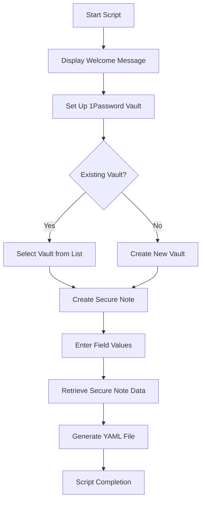

# CICD Project Setup Template

> "A set of templates for creating cicd integrated Github Repos, based on setting up project credentials via 1password API, then creating github repo, secrets, and action"

This project is to eventually be a workflow for creating new Github Actions CICD integrated projects. It will begin as a template or two, and expand from there.

This project was created to simplify the project of managing secrets with 1Password and dynamically generating Github Action CICD YAML configuration files for DevOps workflows.

It's designed for developers and DevOps engineers who want a streamlined way to interact with 1Password's CLI and automate the injection of 1password items into configuration files-- demonstrating examples of plaintext config values (e.g. public, not necessary to protect info such as some configuration values), as well as typically protected passwords (e.g. API keys and other secrets).

It's a process to essentially bootstrap the following things:

- Credentials (1password, github action secrets)
- Github repo creation
- Github Action script creation & environment variable substitution.

## Project Plan

This project will grow from a basic proof of concept into a useful way to automate the creation of new CICD-integrated docker projects hosted in github repos.

The end result will be one script which does the following:

- Setups up CICD credentials needed for Github Action to log into my server & pull my app's latest docker image(s), as well as the CICD file:
  - 1password credentials setup locally
  - github repo creation
  - github action secrets creation, for use with github action
  - github action (the CICD Script) written, and injected with env vars from 1pass (for plaintext config items such as github username, docker username, container registry to use), and referencing github action secrets previously created (server ip, server username, ssh private key to allow github action runner to connect to server, github token)

## **How It Works**

This script automates three primary tasks:

1. **Vault Setup**:

   - Create a new 1Password vault or select an existing one.
   - Default vault name: `ExperimentVault1`.

2. **Secure Note Creation**:

   - Create a secure note with two customizable fields: `projectName` and `registryName`.
   - Default secure note name: `ExperimentSecureNote1`.

3. **YAML File Generation**:
   - Retrieve the secure note's fields and inject their values into a `basic-yaml-env-subst.yml` file.

---

## Things to keep in mind when working with 1password

I previously used 1password at an employer and began using it for personal projects. It's great because it offers secure password storage, plus an API to access passwords programmatically.

1password is structured in a bit of a hierarchy, where key/value pairs are essentially at the level of "fields"

Vault -> Item -> Field(s).

For this project's item is a "Secure Note"-- but there are many [categories of items](https://support.1password.com/item-categories/) available. I like using Secure Note simply because it's an easy place for me to keep short project descriptions next to a project's main config values & secrets. Secure Notes are essentially just a small markdown file. And fields are just key/value pairs attached to the secure note.

- Items have a name & category. Items are sort of like a page in a roladex. They can hold multiple things in them, in this case, "fields"-- which are typically key/value pairs.
- Field(s) can even have sections.
- Technically, other useful things can be stored at the field level, such as storing small files (useful for key files), and MFA-auto-authenticator (this is a super useful functionality providing automated MFA token generation based on QR code screen capturing-- rather than doing so via a smart phone authenticator app)-- but that is beyond the scope of this project.

## **Project Workflow**



---

## **Getting Started**

### **Prerequisites**

- **1Password CLI (`op`)**: Ensure it's installed and authenticated. [Download here](https://developer.1password.com/docs/cli/get-started/). You'll need to create an account and then run `op signin` once it's installed
- **`jq`**: A lightweight JSON processor. Install it via your package manager:
  ```bash
  sudo apt install jq # Debian/Ubuntu
  brew install jq     # macOS
  ```

### **Running the Script**

1. Clone the repository:
   ```bash
   git clone <repo-url>
   cd <repo-directory>
   ```
2. Make the script executable:
   ```bash
   chmod +x createProject.sh
   ```
3. Run the script:
   ```bash
   ./createProject.sh
   ```

---

## **File Outputs**

### **Generated YAML File**

The script creates a YAML file (`basic-yaml-env-subst.yml`) that integrates the secure note data:

```yaml
# basic-yaml-env-subst.yml

name: 1. build, publish, 2. login, pull, run.

on:
  push:
    branches:
      - main
env:
  REGISTRY: "ghcr.io/YourRegistryName"
  PROJECT_NAME: "YourProjectName"
```

---

## **Key Features**

### **Interactive Prompts**

- Choose between creating a new vault or using an existing one.
- Provide default names for vaults and secure notes, which you can override.

### **1Password CLI Integration**

- Leverages `op` commands for managing vaults and secure notes.
- Uses `jq` to extract and process JSON data from 1Password.

### **Functional Programming Style**

- The script is organized into modular functions for clarity and maintainability.

---

## **Command Reference**

### **Create a Secure Note**

In 1password, there's a bit of a hierarchy:

The script uses the following command to create a secure note with two fields-- it specifies which vault, item category, item title, and fields to create.

```bash
op item create \
 --category 003 \
 --title "SecureNoteTitle" \
 --vault VaultName \
 'projectName[text]=ProjectValue' \
 'registryName[text]=RegistryValue'
```

Regarding how to set up each "field" (key/value pairs), here are some excerpts from the from the [1password docs](https://developer.1password.com/docs/cli/item-create/#with-an-item-json-template):

> The op item create command can take a list of assignment statements as arguments to create fields on an item.

> Assignment statements are formatted like this:

> `[<section>.]<field>[[<fieldType>]]=<value>`

> - **section (Optional)** The name of the section where you want to create the field.
> - **field** The name of the field you want to create.
> - **fieldType** The type of field you want to create. If unspecified, fieldType will default to password.
> - **value** The information you want to save in the field.

```bash
# An example from the docs:
op item create \
 --category login \
 --title "HBO Max" \
 --vault Tutorial \
 --url 'https://www.hbomax.com' \
 --generate-password='letters,digits,symbols,32' \
 --tags tutorial,entertainment \
 'username=john.doe@acme.org' \
 'Subscription Info.Renewal Date[date]=2022-12-31'

# So, in our example, we'd do something like this:
op item create \
 --category 003 \
 --title "DevOpsSecureNote" \
 --vault Exp123 \
 'projectName[text]=someTextABC' \
 'registryName[text]=someTextDEF'
```

`--category 003` represents an item type of "Secure Note". See others by running `op item template list`:

```
❯ op item template list
UUID    NAME
113     Medical Record
104     Outdoor License
005     Password
109     Wireless Router
103     Driver License
004     Identity
006     Document
111     Email Account
110     Server
108     Social Security Number
100     Software License
114     SSH Key
112     API Credential
102     Database
003     Secure Note
002     Credit Card
107     Reward Program
001     Login
105     Membership
106     Passport
101     Bank Account
115     Crypto Wallet
```

### **Retrieve Secure Note Data**

```bash
op item get SecureNoteID --vault VaultName --format json | jq '.'
```

---

## **Troubleshooting**

- **Authentication Issues**: Ensure you are logged in to the `op` CLI:
  ```bash
  eval $(op signin)
  ```
- **Missing Dependencies**: Make sure `op` and `jq` are installed and accessible in your `PATH`.
