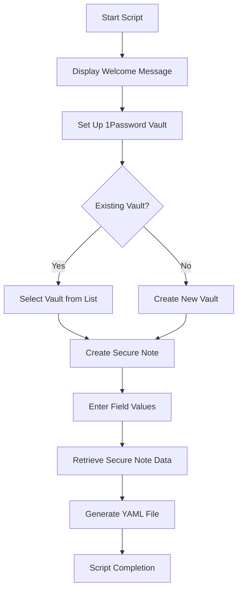

# Template Step 1

In this example, we keep the script super simple. This is simply a proof of concept.

We focus on adding two fields to 1password, then doing a basic environment variable substitution on a yaml file.

The yaml file represents a future Github Actions CICD file, to which we will add env vars which will be involved in our CICD process-- Such as our preferred Container Registry (in my case, Github Container Registry: ghcr.io), Our Docker username, our Github Username.

In future iterations, we'll also create a github repo for the project, as well as add secrets from 1password to the github repo's Github Action secrets.

## **How It Works**

This script automates three primary tasks:

1. **Vault Setup**:

   - Create a new 1Password vault or select an existing one.
   - Default vault name: `ExperimentVault1`.

2. **Secure Note Creation**:

   - Create a secure note (Default name `ExperimentSecureNote1`) with two customizable fields: `projectName` and `registryName`.

3. **YAML File Generation**:
   - Retrieve the secure note's fields and inject their values into a `basic-yaml-env-subst.yml` file.

---

## **Project Workflow**



---

## **File Outputs**

### **Generated YAML File**

The script creates a YAML file (`basic-yaml-env-subst.yml`) that integrates the example data (registryName, projectName) from the 1password "secure note" item:

```yaml
# basic-yaml-env-subst.yml

name: 1. build, publish, 2. login, pull, run.

on:
  push:
    branches:
      - main
env:
  REGISTRY: "ghcr.io/registryName"
  PROJECT_NAME: "projectName"
```
